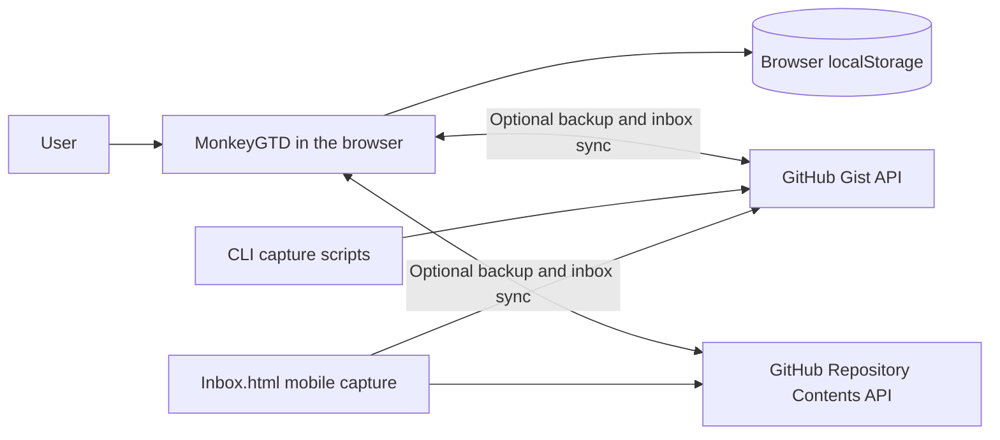
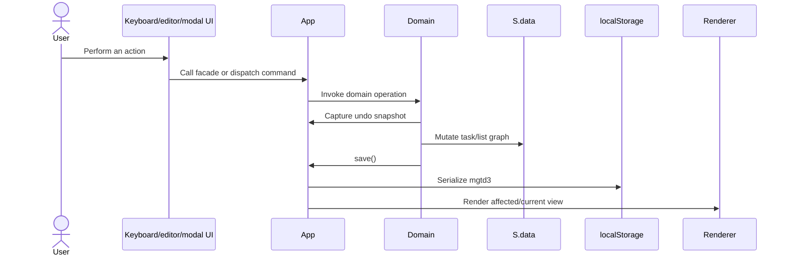

# MonkeyGTD Architecture Overview

## Purpose and architectural style

MonkeyGTD is a local-first, keyboard-oriented task manager and hierarchical outliner inspired by Checkvist. It is a browser application built with plain HTML, CSS, and JavaScript. There is no frontend framework, package bundler, application server, or runtime dependency installation.

The repository supports two equivalent delivery forms:

- `app.html` loads the editable CSS and JavaScript source files from the repository.
- `monkeygtd-standalone.html` contains the same HTML, CSS, and JavaScript in one portable file and is the artifact deployed to GitHub Pages.

The source is organized into core, domain, application, infrastructure, and UI directories. At runtime, however, these files are classic scripts sharing a global scope. `js/app.js` is the composition root and facade that connects them.

## System context



The application works without remote services. Browser `localStorage` is the primary persistence mechanism. GitHub Gist and repository synchronization are optional backup, cross-device synchronization, and remote-capture paths; they are not a backend required to run the app.

## Runtime composition

`app.html` provides the static DOM structure and loads scripts in dependency order:

1. `js/core/` supplies generic primitives, traversal, parsing, task/list factories, and small command/query buses.
2. `js/domain/` supplies task, tree, list, lifecycle, clipboard, import/export, and query behavior.
3. `js/application/` registers commands and queries and provides smoke checks.
4. `js/infra/` supplies local and remote persistence adapters.
5. `js/ui/` supplies rendering and browser interaction controllers.
6. `js/app.js` creates application state, exposes the `App` facade, delegates work to the other layers, and calls `App.init()`.

These are not ES modules: script order is part of the runtime contract. Functions declared in an earlier file are available to files loaded later. Adding or moving a source file therefore also requires reviewing the `<script>` order in `app.html` and regenerating the standalone artifact.

## Main components

### Composition root and state: `js/app.js`

`js/app.js` contains the two central runtime objects:

- `S` is the mutable session state. It holds persisted data plus transient UI state such as the current page, selected task, hoisted task, multi-selection, search filter, undo/redo stacks, command-palette state, and modal/editor state.
- `App` is the public application facade. HTML handlers and UI controllers call its methods. It owns startup, saving, undo/redo coordination, command/query dispatch, and delegation to domain, UI, and sync functions.

On startup, `App.init()`:

1. Reads the `mgtd3` record from `localStorage` through `DB`.
2. Creates seeded example data if no saved data exists.
3. Initializes current-list and transient reporting/UI state.
4. Applies persisted visual settings.
5. Creates and registers the command and query services.
6. Binds global browser events and renders the current page.
7. Starts the configured optional synchronization provider.

`App` is also an anti-corruption facade for the partially extracted codebase: many methods are deliberately thin wrappers around functions such as `addTaskDomain`, `renderListUi`, or `syncRepoBidirectionalRemote`. This keeps existing callers stable while behavior is separated into focused files.

### Core: `js/core/`

The core directory contains broadly reusable primitives:

- `utils.js` defines IDs and timestamps, date helpers, safe link normalization, Markdown rendering, smart-syntax parsing, task history, task/list factories, and first-run seed data.
- `traversal.js` provides depth-first traversal of the ID-based task tree and a sentinel for skipping descendants.
- `cqrs.js` provides small in-memory command and query registries.

The command/query implementation is intentionally lightweight. A command name resolves to one mutation handler; a query name resolves to one read-model function. It does not provide queues, persistence, events, or asynchronous orchestration by itself.

### Domain: `js/domain/`

The domain layer implements the task-management rules:

- `task-crud-ops.js`: create, edit, delete, complete, invalidate, recur, and collapse tasks.
- `tree-ops.js`: sibling ordering, indentation, ancestry, and movement within or across lists.
- `task-ops.js`: assignment and sorting.
- `list-ops.js`: create/update, archive, restore, and delete lists.
- `lifecycle-ops.js`: restore deleted tasks, wipe/reset completed work, and extract a branch as a list.
- `clipboard-ops.js`: branch cloning and copy/cut/paste behavior.
- `import-export.js`: text, Markdown, and OPML transformations.
- `queries.js`: visible tasks, filters, due-date sections, tag clouds, reports, statistics, export output, and move/palette targets.
- `settings-ops.js`: persisted application and display settings.

Domain mutation functions generally receive `app` and `state` explicitly. They update `state.data`, then use facade services such as `app.pushUndo()`, `app.save()`, `app.render()`, or `app.toast()`. Consequently, this is a pragmatic layered design rather than a pure, dependency-free domain model.

### Application layer: `js/application/`

The application layer names and wires use cases:

- `command-registry.js` maps names such as `task.add`, `task.edit`, `task.toggleStatus`, and `task.moveToList` to `App` operations.
- `query-registry.js` supplies dependencies to and registers the read model defined in `domain/queries.js`.
- `smoke-checks.js` contains browser-runnable structural and behavioral health checks.

Not every interaction goes through the command bus yet. Some paths call `App` or domain functions directly, while commands provide a stable route for the use cases that have been registered.

### UI: `js/ui/`

The UI is controller-oriented and renders directly into the DOM:

- `render-controller.js` renders list, due, tags, reporting, and Kanban views.
- `keyboard-controller.js` interprets command-mode shortcuts and global key events.
- `editor-controller.js` manages inline editing and smart-syntax autocomplete.
- `modal-controller.js` owns dialogs for due dates, repetition, tags, notes, JSON editing, movement, import/export, list management, and related workflows.
- `command-palette-controller.js` and `command-palette-commands.js` implement discoverable command execution.
- The remaining controllers cover navigation, browser chrome, search, settings, clipboard access, utility actions, and storage display.

UI controller functions conventionally end in `Ui` and receive `app` and/or `state`. `App` exposes wrapper methods so DOM event handlers have one stable entry point.

Rendering is state-driven but not virtual-DOM based. Mutations normally update the in-memory model, save it, and ask the relevant renderer—or the entire current page—to rebuild DOM content.

### Infrastructure: `js/infra/`

- `storage.js` serializes the full persisted data model into the `mgtd3` `localStorage` key.
- `gist-sync.js` reads and writes a versioned JSON backup through the GitHub Gist API and consumes an NDJSON inbox queue.
- `repo-sync.js` provides equivalent behavior through the GitHub Repository Contents API, including write-conflict handling.

The selected sync provider can pull, push, compare local and remote timestamps, run on refresh, and run periodically. Sync credentials and configuration live in settings/local storage. Incoming inbox records identify a destination list or parent and are converted into normal task records before being marked processed.

`Inbox.html` is a separate lightweight capture client for either sync provider. The capture scripts under `scripts/` provide the command-line equivalent for a Gist inbox. These clients write requests to a remote inbox queue; the main application applies those requests during synchronization.

## Data model

The persisted root object has five important areas:

```text
data
├── lists: { [listId]: List }
├── tasks: { [taskId]: Task }
├── settings: { ... }
├── deletedItems: [{ taskId, snapshot, deletedAt }, ...]
└── currentListId: string
```

The task hierarchy is normalized around IDs:

- A list stores ordered root task IDs in `root_tasks`.
- A task stores its parent ID in `parent_id` and ordered child IDs in `tasks`.
- All complete task records are stored once in the root `tasks` map.
- `checklist_id` identifies the owning list and must be updated when a branch moves across lists.
- `position` exists in the record, but sibling array order is the primary structural ordering used by tree operations.

Task records include content, three-state status, due/repeating information, tags, priority color, assignees, notes, history, timestamps, soft-deletion state, and collapsed state. Factories and the authoritative field defaults live in `mkTask()` and `mkList()` in `js/core/utils.js`; the user-facing schema is also described in `readMe.md`.

There are two state lifetimes:

- `S.data` is persisted and synchronized.
- The remaining fields in `S` are session-only interaction state and are reconstructed on page load.

Undo and redo snapshot only the `tasks` and `lists` maps. Settings and transient UI state are outside those snapshots.

## Typical request flows

### Local task mutation



Exact render timing varies by operation: lower-level domain functions may only save and return, while the calling UI workflow performs selection changes, rendering, and feedback.

### Read and render

Renderers ask `App.select(name, payload)` for registered read models such as visible tasks, due sections, report rows, or statistics. Query resolvers traverse `S.data` and return derived values; render controllers turn those values into DOM markup and bind them to the current view.

### Remote synchronization

The configured adapter fetches remote backup metadata/content, compares remote and local timestamps, and chooses a pull or push for bidirectional sync. A pull replaces synchronized application data while preserving local sync configuration, then saves and rerenders. The same cycle reads the remote inbox queue, applies unprocessed capture requests, and writes their processed state back remotely.

## Build, test, and deployment

Development requires no compilation: open or serve `app.html` so its relative CSS and script paths resolve.

`inline-html.ps1` is the packaging step. It:

1. Reads `app.html`.
2. Embeds deployment commit metadata.
3. Replaces the stylesheet link with inline CSS.
4. Concatenates scripts in their HTML load order into one inline script.
5. Writes `monkeygtd-standalone.html`.

The npm scripts use Node's built-in test runner through `scripts/run-tests.cjs`:

- `npm test` runs all tests.
- `npm run test:unit` and `npm run test:integration` run their respective suites.
- `npm run check:standalone` verifies that the generated artifact is current.
- `npm run check:test-policy` enforces the repository's test-change policy.
- `npm run test:ci` applies the policy check and runs the tests.

Many unit tests load individual classic-script files into a Node `vm` context and inject browser-like collaborators such as `fetch`, `document`, and `localStorage`. Integration tests also verify project layout and cross-module behavior.

On pushes to `master`, `.github/workflows/pages.yml` regenerates the standalone file, publishes it as `index.html`, includes `Inbox.html`, and deploys the result to GitHub Pages.

## Architectural constraints and extension guidance

When changing the application, keep these constraints in mind:

- Treat `app.html` script order as a dependency graph. There is no module loader to resolve imports.
- Preserve tree invariants: parent and child references, list roots, owning `checklist_id`, and sibling order must agree.
- Route durable mutations through `App.save()` so local-change timestamps used by synchronization remain correct.
- Capture undo state before user-visible task/list mutations, and use undo batching for multi-selection operations.
- Keep persisted data JSON-serializable; `Set`, DOM nodes, timers, and other runtime objects belong in session state, not `S.data`.
- Add derived reads to the query registry when multiple views need the same non-trivial projection.
- Put browser rendering and event behavior in `js/ui/`, task/list rules in `js/domain/`, and external storage/API behavior in `js/infra/`.
- Update both automated tests and the generated standalone file when source behavior changes.

The current architecture is best understood as an incremental modularization of a single-page global application. The directory boundaries are useful and increasingly explicit, but `App` and `S` remain the shared integration seam. New work should respect those boundaries without assuming stronger isolation than the runtime currently provides.
